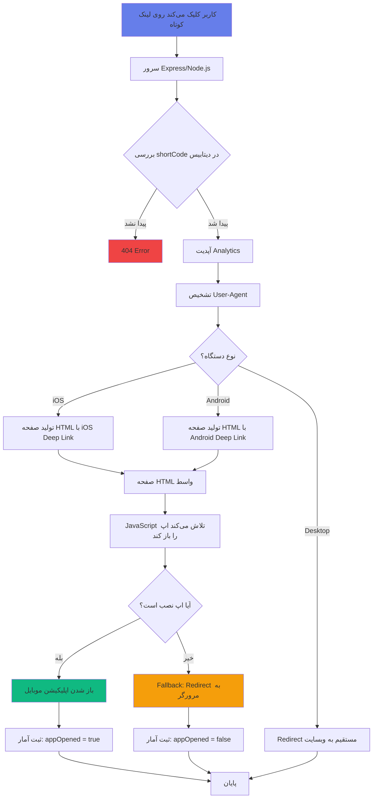

## نمونه URL Schemes:

```javascript
// YouTube
youtube://watch/{video_id}
vnd.youtube://watch/{video_id}

// Instagram  
instagram://user?username={username}
instagram://media?id={post_id}

// Spotify
spotify://track/{track_id}

// TikTok
snssdk1233://video/{video_id}

// Twitter/X
twitter://user?screen_name={username}

// Amazon
amazon://www.amazon.com/dp/{product_id}
```

## مثال واقعی Deep Linking:

### قبل (لینک عادی):
```
https://youtube.com/watch?v=dQw4w9WgXcQ
```
👎 وقتی در اینستاگرام کلیک می‌شود → باز می‌شود در مرورگر درون‌اپلیکیشن → کاربر لاگین نیست → تجربه بد

### بعد (با Deep Link):
```
https://yourdomain.com/abc123
```
👍 وقتی کلیک می‌شود → مستقیماً اپ یوتوب باز می‌شود → کاربر لاگین است → تجربه عالی → نرخ subscribe بالاتر
